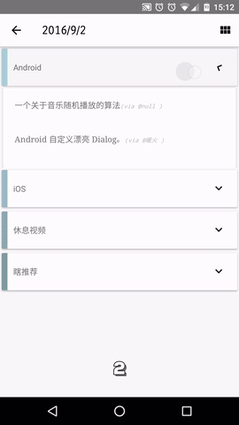
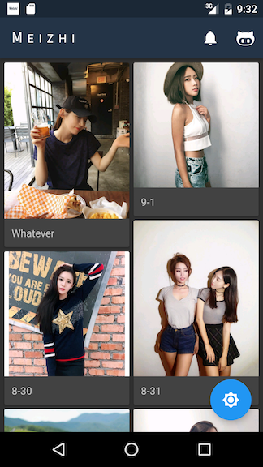
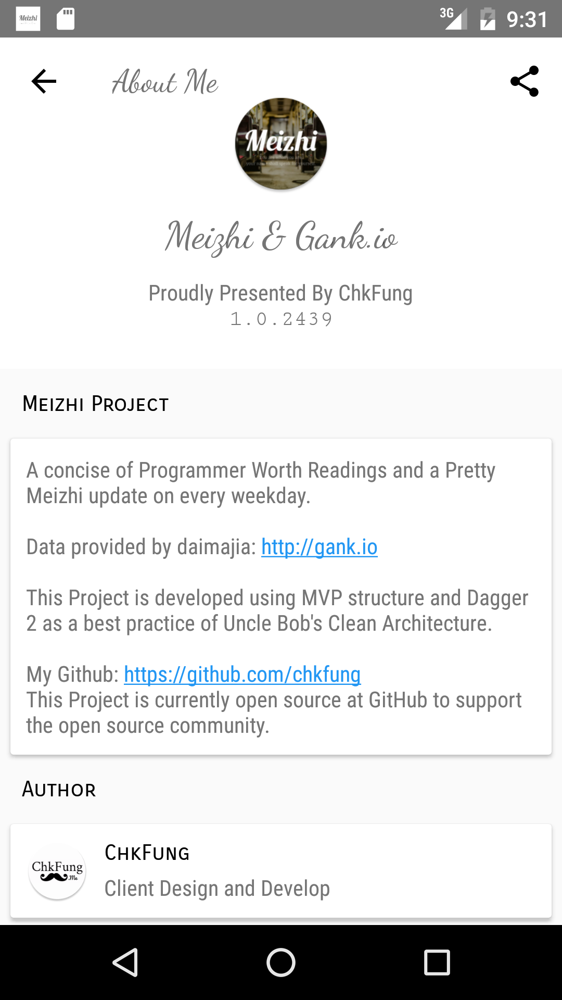
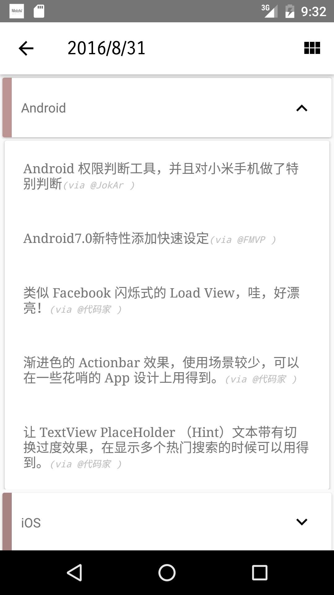
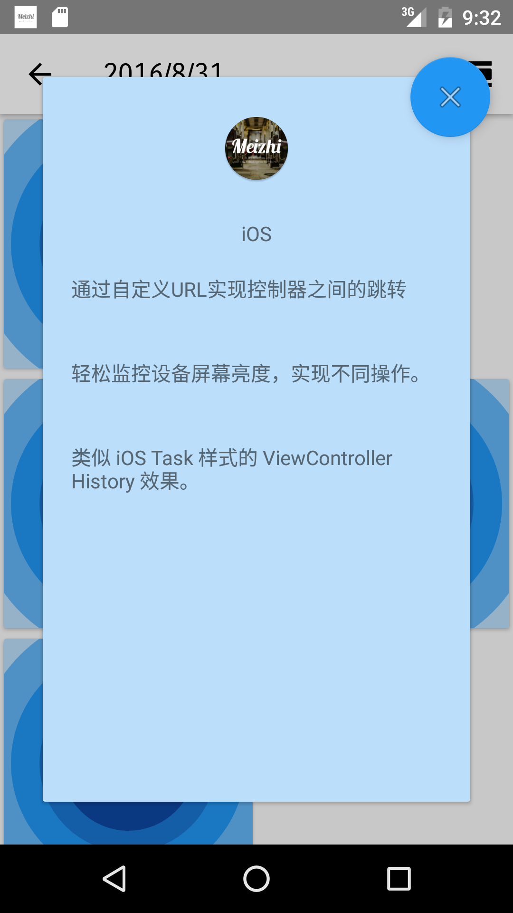

# Meizhi & Gank.io / 妹纸 & Gank.io


## Overview

A concise of Programmer Worth Readings and a Pretty Meizhi update on every weekday.

Data provided by daimajia: http://gank.io 

This Project is developed using MVP structure and Dagger 2 as a best practice of Uncle Bob's Clean Architecture.


每天都会更新一篇值得阅读的程式员精选干货和一个精选妹纸！

数据内容来源于代码家的 http://gank.io

这个项目是用 MVP 和 Dagger 2 开发的，并且以 Uncle Bob's Clean Architecture 为模板以达到干净代码的实现。


## Download

[Google Play](https://play.google.com/store/apps/details?id=me.chkfung.meizhigankio)

[酷安市场 Cool APK](http://www.coolapk.com/apk/me.chkfung.meizhigankio)

## Screenshot:












## Thanks

[Drakeet](https://github.com/drakeet)
[代码家](https://github.com/daimajia)

## License

```
Meizhi & Gank.io
Copyright (C) 2016 ChkFung

This program is free software: you can redistribute it and/or modify
it under the terms of the GNU General Public License as published by
the Free Software Foundation, either version 3 of the License, or
(at your option) any later version.

This program is distributed in the hope that it will be useful,
but WITHOUT ANY WARRANTY; without even the implied warranty of
MERCHANTABILITY or FITNESS FOR A PARTICULAR PURPOSE.  See the
GNU General Public License for more details.

You should have received a copy of the GNU General Public License
along with this program.  If not, see <http://www.gnu.org/licenses/>.
```